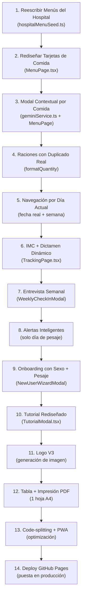

# Plan de Mejora Profunda — Mi Gordólogo v2.0

## Diagnóstico General

Tras una auditoría exhaustiva del código fuente, datos del hospital, capturas de pantalla y feedback del usuario, este plan identifica **42 defectos y mejoras** agrupados en 10 bloques funcionales. El objetivo es transformar el prototipo actual en una **aplicación entregable y útil para María Ignacia** (y cualquier otro usuario).

---

## User Review Required

> [!CAUTION]
> **Clave de IA (Gemini API)**: Tu suscripción de pago de Google (Google One / Workspace) **NO incluye acceso a la API de Gemini**. La API de Gemini tiene su propia capa gratuita en [Google AI Studio](https://aistudio.google.com/apikey) que permite hasta 1.500 peticiones/día con el modelo `gemini-2.0-flash`. **No hay riesgo de cobro**: la capa gratuita NO pide tarjeta de crédito. Si superas las 1.500 peticiones, la API simplemente devuelve un error HTTP 429 (Rate Limit) y la app activará automáticamente el motor de respaldo offline. No se cobra nada extra. Es 100% seguro.

> [!IMPORTANT]
> **Despliegue gratuito**: Para usar la app fuera de localhost, el plan más sencillo y gratuito es **GitHub Pages** (tu cuenta ya tiene perfil en GitHub). Al final del documento hay un plan de puesta en producción detallado paso a paso.

---

## Decisiones Confirmadas por el Usuario

| Pregunta | Respuesta |
|----------|-----------|
| **Día de pesaje** | **Jueves por la mañana** (configurable desde la app) |
| **Entrevista del Gordólogo** | **Jueves tras el pesaje** (unificado con el pesaje). Cuestionario interactivo con opciones preconfiguradas seleccionables. |
| **Logotipo V3** | Medio cuerpo del personaje V2 (barbudo con limón) + tipografía estilo V1 + "Adelgaza sin comer". ✅ |
| **Ciclo de menús** | **8 semanas**: 3 del hospital + 5 generadas con los mismos patrones, sin repetir. Semana 9 = Semana 1 (ciclo de 8). |
| **API Gemini gratuita** | Sin riesgo de cobro. Si se pasan las 1.500 peticiones/día, la app usa el motor offline automáticamente. |

---

## Bloque 1 — Menús: Fidelidad a las Dietas del Hospital

### Problema detectado
Los menús del `hospitalMenuSeed.ts` fueron **inventados parcialmente** y no corresponden fielmente a los 21 menús de comida + 21 menús de cena del protocolo del Hospital Morales Meseguer. Se utilizaron nombres genéricos ("Arroz Salteado con Champiñones y Pavo", "Sopa de Cebolla Gratinada con Salmón") que **no aparecen en las dietas originales**.

### Hallazgos Críticos de la Auditoría Documental

La auditoría de los documentos originales (`Version accesible/Menus_de_hospital.docx`) ha revelado:

1. **El hospital define 21 menús de comida (Menú 1-21) y 21 menús de cena (Menú 1-21)** — NO los 18-19 que tiene el código actual.
2. **Existe una tabla de rotación OFICIAL** que asigna exactamente qué menú va en cada día de cada semana:

| Semana | Día | Comida | Cena |
|--------|-----|--------|------|
| **Sem 1** | 1 | Menú 1 (Cocido) | Cena 11 |
| | 2 | Menú 2 (Olla gitana) | Cena 12 |
| | 3 | Menú 3 (Guiso pescado) | Cena 13 |
| | 4 | Menú 4 (Ensalada pasta) | Cena 14 |
| | 5 | Menú 5 (Ensalada alubias) | Cena 15 |
| | 6 | Menú 6 (Patata/merluza) | Cena 16 |
| | 7 | Menú 7 (Murciana) | Cena 17 |
| **Sem 2** | 8 | Menú 8 (Pescado asado) | Cena 18 |
| | 9 | Menú 9 (Arroz champiñón) | Cena 19 |
| | 10 | Menú 10 (Arroz cubana) | Cena 20 |
| | 11 | Menú 3 (repetido) | Cena 21 |
| | 12 | Menú 6 (repetido) | Cena 13 |
| | 13 | Menú 8 (repetido) | Cena 16 |
| | 14 | Menú 9 (repetido) | Cena 18 |
| **Sem 3** | 15 | Menú 1 (repetido) | Cena 20 |
| | 16 | Menú 5 (repetido) | Cena 15 |
| | 17 | Menú 7 (repetido) | Cena 12 |
| | 18 | Menú 4 (repetido) | Cena 19 |
| | 19 | Menú 10 (repetido) | Cena 17 |
| | 20 | Menú 2 (repetido) | Cena 14 |
| | 21 | Menú 6 (repetido) | Cena 11 |

3. **Reglas hospitalarias NO implementadas**:
   - **Recena (colación nocturna)**: 1 yogur desnatado ó ½ vaso de leche desnatada antes de dormir → NO existe en la app.
   - **Postre obligatorio** en comida y cena: 1 ración de fruta o 2 yogures desnatados → NO se muestra en las tarjetas.
   - **Aceite de oliva**: 1,5 cucharadas en comida, 1 cucharada en cena → NO se indica por plato.
   - **Pesos de fruta por grupo** (A=300g, B=200g, C=160g, D=100g) → La app pone "1 ración" genéricamente.
   - **Prohibiciones**: Alcohol, cerveza sin alcohol, azúcar, fructosa, miel → NO aparecen como recordatorio.

4. **El "Día Libre" NO existe en el protocolo clínico** — es una petición del usuario (José Antonio) en el audio de requisitos. Está bien implementarlo, pero hay que dejarlo claro en la UI como decisión personal, no hospitalaria.

### Cambios propuestos

#### [MODIFY] `src/data/hospitalMenuSeed.ts`
- **Reescritura completa** de `HOSPITAL_LUNCHES` (21 menús) y `HOSPITAL_DINNERS` (21 menús de cena) utilizando **exactamente** los datos del documento del hospital.
- Cada menú codificado con su **número identificador original** para trazabilidad (ej: `menuId: 'comida_07'` para Ensalada Murciana).
- Las cantidades **exactas del protocolo**: `60g garbanzos crudos / 9 cdas cocido`, `150g pescado blanco`, `200g patatas`, etc.
- **Ciclo de 8 semanas**:
  - **Semanas 1-3**: Rotación oficial del hospital (tabla exacta de arriba).
  - **Semanas 4-8**: 5 semanas adicionales generadas combinando los mismos 21+21 menús en **nuevas combinaciones que no repitan** ninguna semana anterior, respetando las frecuencias del hospital (2-3 legumbres/semana, 1 arroz, 1 pasta, 1 patata, 1 verdura principal).
  - **Ciclo**: Semana 9 = Semana 1, Semana 10 = Semana 2, etc. (módulo 8).
- **Añadir postre** a cada comida y cena (fruta o yogur).
- **Añadir recena** como 6ª comida del día (yogur desnatado o ½ vaso leche).
- **Indicar aceite por plato** (1,5 cdas comida / 1 cda cena).

#### Algoritmo de generación de Semanas 4-8
```typescript
// Pool de 21 comidas × 21 cenas = 441 combinaciones posibles
// Semanas 1-3 usan 21 combinaciones (7 días × 3 semanas)
// Semanas 4-8 eligen 35 combinaciones nuevas (7 días × 5 semanas)
// Restricciones:
//   - No repetir el par (comida, cena) de ninguna semana anterior
//   - Cada semana debe tener: ≥2 legumbres, ≥1 pescado, ≥1 carne, ≥1 ensalada
//   - Equilibrio: no 2 días seguidos del mismo tipo de proteína
```

#### [NEW] Tipo `recena` en `src/domain/models/types.ts`
```typescript
export type MealType = 'breakfast' | 'midMorning' | 'lunch' | 'snack' | 'dinner' | 'recena';

export const MEAL_LABELS: Record<MealType, string> = {
  breakfast: 'Desayuno',
  midMorning: 'Media Mañana',
  lunch: 'Comida',
  snack: 'Merienda',
  dinner: 'Cena',
  recena: 'Antes de Dormir',
} as const;
```

### Verificación
- Contrastar cada entrada del seed con `Menus_de_hospital.docx` línea por línea.
- Verificar que la rotación semanal coincida con la tabla oficial del hospital.

---

## Bloque 2 — Modal de Ajuste: Recomendaciones Contextuales

### Problema detectado


Las opciones de "Cambio Rápido en 1 Toque" son **las mismas para todas las comidas del día**, incluyendo absurdos como ofrecer "Ensalada Murciana" como sustituto del desayuno. El motor de respaldo (`fallbackAdjustment`) no distingue entre tipos de comida.

### Cambios propuestos

#### [MODIFY] `src/ui/pages/MenuPage.tsx`
- Las opciones rápidas del modal deben ser **contextuales al tipo de comida** (`mealType`):

  | Momento | Opciones rápidas permitidas |
  |---------|---------------------------|
  | **Desayuno** | Tostada con tomate y aceite · Yogur con fruta · Queso fresco con pan · Leche con cereales integrales |
  | **Media mañana / Merienda** | Fruta de temporada · Yogur desnatado · Infusión con frutos secos |
  | **Comida** | Pollo a la plancha · Pescado blanco · Ensalada Murciana · Tortilla con ensalada · Lentejas caseras · Arroz con verduras |
  | **Cena** | Hervido de verduras · Crema de calabacín · Ensalada templada · Sopa de pescado · Escalivada con sepia |

#### [MODIFY] `src/domain/services/geminiService.ts`
- El `fallbackAdjustment` debe recibir y usar `mealType` (actualmente recibe `_mealType` con guion bajo = ignorado).
- Las sustituciones deben derivarse **exclusivamente** de los menús aprobados por el hospital para ese momento del día.
- Eliminar sustituciones que no correspondan (ej: una ensalada murciana no puede ser un desayuno).

---

## Bloque 3 — Diseño de Fichas de Comida

### Problemas detectados


1. **Título redundante**: "Desayuno → Tortilla Francesa con Ensalada Completa" no tiene sentido si luego detallas cada ingrediente. El `recipeName` debe usarse solo cuando es un plato elaborado (guiso, cocido, etc.), no como título genérico.
2. **Etiquetas sin sentido**: `"1 ración"`, `"1 plato grande"`, `"Segundo plato"` no aportan valor. Las etiquetas deben ser **cantidades reales** en gramos (g) o unidades claras.
3. **Formato plano**: Los ingredientes se muestran en lista plana sin jerarquía. Debería ser **título del plato + bullet points** con cada ingrediente y su cantidad.
4. **"Receta Thermomix" como copy suelto**: El texto "🍲 Receta Thermomix:" es redundante junto al botón "Ver en Cookidoo".

### Cambios propuestos

#### [MODIFY] `src/ui/pages/MenuPage.tsx` — Rediseño de tarjetas de comida
```
ANTES:
  ☕ Desayuno
  Tortilla Francesa con Ensalada Completa     [Ajustar]
  ─────────────────────────────────
  Tortilla francesa (1 huevo entero ó 1 yema + 2 claras)
  [1 ración]                      Segundo plato
  
  Ensalada mixta (lechuga, tomate, pepino)
  [1 plato grande]                Primer plato
  
  Pan integral
  [20 g]
  
  🍲 Receta Thermomix:  [Ver en Cookidoo ↗]

DESPUÉS:
  🌅 Desayuno                                 [Ajustar]
  ─────────────────────────────────
  • Leche desnatada con café ............. 200 ml
  • Fruta fresca de temporada ............ 150 g
  • Pan integral tostado ................. 20 g
  
  ó (cuando es un plato elaborado):
  
  🍲 Comida                                   [Ajustar]
  Cocido Tradicional Desgrasado
  ─────────────────────────────────
  • Consomé desgrasado ................... 1 taza
  • Garbanzos + judías verdes + patata ... 60g + 150g + 50g
  • Pollo sin piel ....................... 100 g
  • Pan integral ......................... 20 g
  
  [Ver en Cookidoo ↗]
```

- **Eliminar `recipeName` del header** cuando es genérico/inventado (ej: "Tortilla Francesa con Ensalada Completa"). Solo mostrarlo cuando es un plato con identidad propia (cocido, olla gitana, ensalada murciana...).
- **Eliminar la línea "Receta Thermomix:"** — integrar directamente el botón `[Ver en Cookidoo ↗]` al final de la tarjeta sin copy previo.
- **Convertir las etiquetas** de `"1 ración"`, `"1 plato grande"`, `"Segundo plato"` a cantidades numéricas reales.
- **Eliminar `notes` de tipo "Primer plato" / "Segundo plato"** — no añaden valor en una app para personas mayores.

#### [MODIFY] `src/data/hospitalMenuSeed.ts`
- Revisar **todos** los `quantity` del seed y sustituir expresiones vagas (`"1 ración"`, `"1 plato grande"`, `"Plato único abundante"`) por cantidades en gramos o unidades concretas según el protocolo hospitalario.

---

## Bloque 4 — Iconos de las Comidas

### Problema detectado
Los emojis actuales no transmiten el momento del día:
- `breakfast: '☕'` → OK pero podría ser mejor
- `midMorning: '🍎'` → No se entiende como "media mañana"
- `lunch: '🍲'` → OK
- `snack: '🧃'` → Zumo en brick, no transmite "merienda" para una señora de 68 años
- `dinner: '🌙'` → OK, luna = noche

### Cambios propuestos

#### [MODIFY] `src/ui/pages/MenuPage.tsx`
```typescript
const MEAL_EMOJIS: Record<MealType, string> = {
  breakfast: '🌅',    // Amanecer = primera hora
  midMorning: '☀️',   // Sol de media mañana
  lunch: '🍽️',        // Plato y cubiertos = comida principal
  snack: '🍵',        // Taza de infusión = merienda
  dinner: '🌙',       // Luna = cena (mantener)
};
```

---

## Bloque 5 — Selector de Raciones: Funcionalidad Real

### Problema detectado


El selector de "2 Raciones" solo **añade un `(×2)` textual** a las cantidades mostradas. No duplica numéricamente nada. Es cosmético.

### Cambios propuestos

#### [MODIFY] `src/ui/pages/MenuPage.tsx` — Función `formatQuantity`

La función debe **parsear y duplicar numéricamente** las cantidades:

```typescript
const formatQuantity = (qty: string | null): string => {
  if (!qty) return '';
  if (servings === 1) return qty;
  
  // Parsear cantidades numéricas y multiplicar por 2
  return qty.replace(
    /(\d+(?:[.,]\d+)?)\s*(g|ml|kg|l|unidad|pieza|cucharada|biscote|lata|huevo|rebanada)/gi,
    (_, num, unit) => {
      const val = parseFloat(num.replace(',', '.'));
      const doubled = Math.round(val * 2 * 10) / 10;
      return `${doubled} ${unit}`;
    }
  );
};
```

Ejemplo:
- `"200 ml"` × 2 → `"400 ml"`
- `"100 g"` × 2 → `"200 g"`
- `"20 g (o 2 biscotes)"` × 2 → `"40 g (o 4 biscotes)"`
- `"1 pieza"` × 2 → `"2 piezas"`

---

## Bloque 6 — Alerta de Pesaje Semanal: Lógica Inteligente

### Problema detectado
El popup "Toca pesaje semanal (M..." aparece **permanentemente** desde que pasan 7 días del último registro. Debería:
1. Solo aparecer el **día configurado para el pesaje** (ej: lunes).
2. Desaparecer completamente después de ser descartado hasta la próxima semana.
3. No molestar si ya se ha registrado un pesaje esa semana.

### Cambios propuestos

#### [MODIFY] `src/domain/services/storageService.ts`
- **Día de pesaje configurable** (lunes = por defecto) almacenado en `localStorage` con clave `migordologo_weighin_day_{userId}`.
- Getter/setter: `getWeighInDay(userId)` / `setWeighInDay(userId, day)`.
- Accesible desde **Perfil → Recordatorio de Pesaje → Cambiar día**.

```typescript
needsWeeklyWeighIn(userId?: string): { needed: boolean; daysSinceLast: number; lastDate: string | null } {
  const now = new Date();
  const todayDayOfWeek = now.getDay(); // 0=domingo, 1=lunes...
  
  // Día configurado (por defecto: jueves = 4)
  const weighInDay = this.getWeighInDay(userId); // default: 4
  
  // Si hoy no es el día de pesaje, no mostrar
  if (todayDayOfWeek !== weighInDay) {
    return { needed: false, daysSinceLast: 0, lastDate: null };
  }
  
  // Si ya se ha pesado esta semana, no mostrar
  const list = this.getMeasurements(userId);
  if (list.length > 0) {
    const last = list[list.length - 1];
    const diffDays = Math.floor((now.getTime() - new Date(last.date).getTime()) / 86400000);
    return { needed: diffDays >= 7, daysSinceLast: diffDays, lastDate: last.date };
  }
  
  return { needed: true, daysSinceLast: 999, lastDate: null };
}
```

- **Flujo unificado**: Pesaje → Entrevista del Gordólogo. Cuando el usuario registra su peso el lunes, se abre automáticamente el `WeeklyCheckInModal` con el cuestionario interactivo.

#### [NEW] Paso de configuración en el onboarding
- Añadir al `NewUserWizardModal` un paso: **"¿Qué día prefieres pesarte cada semana?"** con selector de día (Lunes por defecto).
- También configurable después desde **Perfil → Recordatorio de Pesaje**.

---

## Bloque 7 — El Gordólogo: Dictamen Real con Entrevista Semanal

### Problema detectado
El "Dictamen de El Gordólogo" en `TrackingPage.tsx` está **hardcodeado** con texto fijo: "Has bajado 1,1 kg..." y "El agua corporal está en 40%...". No es dinámico, no se calcula con datos reales, y no sirve para nada.

### Cambios propuestos

#### [MODIFY] `src/ui/pages/TrackingPage.tsx`
1. **Dictamen calculado con datos reales**:
   - Comparar último peso vs. anterior (o vs. inicial).
   - Calcular y mostrar **IMC** con explicación visual (semáforo: Normopeso / Sobrepeso / Obesidad I/II/III).
   - Si hay datos de grasa, calcular variación real.
   - Generar texto dinámico según la tendencia (bajada, subida, estancamiento).

2. **Card de IMC explícita** en el resumen superior:
   ```
   ┌──────────┬──────────┬──────────┐
   │ Peso     │ IMC      │ Grasa    │
   │ 77.8 kg  │ 27.9     │ 42.8%    │
   │ -1.1 kg  │ Sobrepeso│ -0.2%    │
   └──────────┴──────────┴──────────┘
   ```
   Con **explicación** debajo: "IMC 27.9 = Sobrepeso. Un IMC entre 18.5 y 24.9 es normal. Tu objetivo sería bajar a ~73 kg para alcanzar IMC 26."

#### [NEW] `src/ui/components/weekly/WeeklyCheckInModal.tsx`
**Entrevista semanal del Gordólogo** — Se activa automáticamente los **jueves por la mañana, justo después de registrar el pesaje**.

Flujo del cuestionario interactivo (opciones preconfiguradas seleccionables):

```
Paso 1: "¿Cómo ha ido la semana con la dieta?"
  ○ He seguido el menú todos los días ✅
  ○ Lo he seguido casi siempre (algún desliz) 🤏
  ○ He tenido varios días malos 😬
  ○ No he podido seguirlo esta semana ❌

Paso 2: "¿Has tenido antojos o tentaciones?"
  ○ No, he estado bien 💪
  ○ Sí, pero he resistido 🦸
  ○ Sí, y he caído en alguno 🍫
  ○ He picoteado entre horas varios días 🍪

Paso 3: "¿Has bebido suficiente agua (1,5L/día)?"
  ○ Sí, todos los días 💧
  ○ La mayoría de días 🚰
  ○ Poco, me cuesta recordarlo 😅

Paso 4: "¿Has hecho ejercicio o caminado esta semana?"
  ○ Sí, he caminado o hecho ejercicio ≥3 días 🚶
  ○ Algo, 1-2 días 🏃
  ○ No he podido esta semana 🛋️

Paso 5: DICTAMEN PERSONALIZADO del Gordólogo
  → Generado con las respuestas + datos de la báscula:
  - Si bajó peso: motivación y refuerzo positivo
  - Si subió: normalización sin culpa + recomendación concreta
  - Si estancamiento: cambio de estrategia
  - Consejo concreto basado en las respuestas débiles
    (ej: si no bebió agua → "Esta semana prueba a llevar
    siempre una botella encima")
```

**Activación**: Tras registrar el peso del jueves, se abre automáticamente el cuestionario. Si no se registra peso, se muestra un banner invitando a pesarse y luego hacer el check-in.

#### [MODIFY] `src/App.tsx` / `src/ui/components/layout/AppLayout.tsx`
- **Control temporal**: La app debe conocer la fecha actual y abrir por defecto en el **día de la semana que es hoy**.
- Los **jueves por la mañana**, tras registrar el pesaje, mostrar automáticamente el cuestionario del Gordólogo.
- Si el usuario no se ha pesado aún ese jueves, mostrar un banner: *"¡Es jueves! Pésate en ayunas y luego tu Gordólogo te dará el parte semanal 🍋"*.

---

## Bloque 8 — Personalización Real por Usuario

### Problema detectado
Al cambiar de perfil (de María Ignacia a un hombre de 36 años), la app **no pregunta nada** y muestra el mismo menú de 1.500 kcal del hospital. El `NewUserWizardModal` existe pero:
1. No genera menús diferentes según sexo, edad, peso, actividad.
2. El `addProfile()` por defecto **vincula el menú** al de María Ignacia (`linkedMenuUserId: 'maria_ignacia'`).
3. No calcula calorías reales según fórmula de Mifflin-St Jeor con corrección por sexo.

### Cambios propuestos

#### [MODIFY] `src/domain/services/storageService.ts`
- `addProfile()` debe **NO vincular por defecto** al menú de María Ignacia.
- `createNewProfileWithIntake()` debe preguntar por **sexo** para la fórmula Mifflin-St Jeor:
  - Hombres: BMR = 10 × peso + 6.25 × altura - 5 × edad + **5**
  - Mujeres: BMR = 10 × peso + 6.25 × altura - 5 × edad **- 161**

#### [MODIFY] `src/ui/components/onboarding/NewUserWizardModal.tsx`
- Añadir campo **Sexo** (Hombre / Mujer).
- Añadir pregunta: **"¿Quieres compartir menú con otro usuario?"** con opción explícita "No, quiero mi propio menú personalizado".
- Si el usuario elige menú propio, generar uno adaptado a sus calorías objetivo (escalando porciones del menú base).

---

## Bloque 9 — Vista Tabla Semanal e Impresión PDF

### Problemas detectados


1. La **banda verde superior** de la tabla ocupa espacio innecesario en la impresión.
2. La tabla debería caber en **una sola hoja** A4 apaisada.
3. Palabras redundantes: "Comida (Mediodía)", "Cena", etc. Demasiado texto por celda.
4. El diseño podría ser más compacto e intuitivo.

### Cambios propuestos

#### [MODIFY] `src/ui/pages/MenuPage.tsx` — Vista tabla
- **Eliminar la banda verde** (`bg-emerald-800`) de la versión impresa. En pantalla, hacerla más discreta.
- **Columnas**: Día | Desayuno | Comida | Cena (sin media mañana ni merienda, que son siempre fruta/yogur).
- **Celdas compactas**: Solo nombre del plato principal, sin detallar ingredientes (ej: "Cocido" en vez de "Cocido murciano con garbanzos 60g, patata 50g...").
- **Código de colores** por tipo de plato: legumbres (marrón), pescado (azul), carne (rojo), ensalada (verde).

#### [MODIFY] `src/index.css` — Reglas de impresión
```css
@media print {
  /* Ocultar TODA la UI excepto la tabla */
  header, nav, .print\\:hidden { display: none !important; }
  
  /* Tabla ocupa toda la hoja */
  @page { 
    size: A4 landscape; 
    margin: 10mm;
  }
  
  body { 
    font-size: 9pt !important; 
    -webkit-print-color-adjust: exact;
  }
  
  /* Logo pequeño en esquina superior */
  .print-header { 
    display: block !important; 
    margin-bottom: 5mm;
  }
}
```

---

## Bloque 10 — Navegación Temporal y Apertura por Día Actual

### Problema detectado
La app siempre se abre en **Lunes de la Semana 1** sin importar qué día es hoy. No hay concepto de "semana actual" ni de avance temporal.

### Cambios propuestos

#### [MODIFY] `src/ui/pages/MenuPage.tsx`
```typescript
// Al cargar, calcular el día actual y la semana
const today = new Date();
const dayOfWeek = today.getDay(); // 0=domingo, 1=lunes...
const mappedDay = dayOfWeek === 0 ? 6 : dayOfWeek - 1; // 0=lunes, 6=domingo

// Calcular semana actual (basada en fecha de inicio del programa)
const startDate = new Date(activeProfile.createdAt);
const weeksSinceStart = Math.floor((today.getTime() - startDate.getTime()) / (7 * 86400000));
const currentWeek = weeksSinceStart % weeks.length; // Rotar entre las semanas disponibles

// Inicializar estado con el día y semana actuales
const [activeWeekIndex, setActiveWeekIndex] = useState(currentWeek);
const [activeDayIndex, setActiveDayIndex] = useState(mappedDay);
```

- Marcar visualmente el **día actual** en el selector con un borde especial o badge "HOY".
- Si es domingo después de las 17:00 y hay datos de pesaje de la semana, activar el **check-in del Gordólogo**.

---

## Bloque 11 — Tutorial: Rediseño Visual

### Problema detectado
Los indicadores de progreso del tutorial (círculos de abajo) son visualmente pobres. El diseño general del modal es funcional pero mejorable.

### Cambios propuestos

#### [MODIFY] `src/ui/components/tutorial/TutorialModal.tsx`
- **Indicadores de progreso**: Sustituir los puntos redondos por una **barra de progreso segmentada** horizontal o chips numerados.
- **Ilustraciones**: Añadir mini-screenshots o iconografía más visual en cada paso.
- **Integración con onboarding**: El tutorial debe mostrarse automáticamente la **primera vez** que se usa la app, como parte del onboarding (después de seleccionar usuario).
- **Configuración de pesaje**: Añadir un paso al tutorial/onboarding para configurar el día de pesaje semanal.

---

## Bloque 12 — Recordatorios Sin Email Manual

### Problema detectado
El sistema actual de recordatorios requiere que el usuario:
1. Copie su email y guarde manualmente.
2. Pulse "Avisar por WhatsApp" (que abre WhatsApp con un mensaje prellenado).

No hay **ningún recordatorio automático real**.

### Cambios propuestos

#### Estrategia viable (100% gratis, sin backend):
1. **Notificaciones del navegador** (Web Push / `Notification API`):
   - Solicitar permiso en el onboarding.
   - Usar `setInterval` para comprobar si toca pesaje al abrir la app.
   
2. **Service Worker** para PWA:
   - Registrar un service worker que muestre notificaciones push locales.
   - Esto funciona incluso cuando la app está cerrada (en Android con PWA instalada).

3. **Eliminar el formulario de email**: No sirve sin backend para enviar correos.

#### [DELETE] Sección de email en `ProfilePage.tsx`
#### [MODIFY] `ProfilePage.tsx` — Sustituir por configuración de notificaciones locales PWA

---

## Bloque 13 — Logotipo V3

### Cambios propuestos

#### [NEW] Generación de logotipo V3:
- **Personaje**: Doctor barbudo con gafas de la V2 (con barba canosa, simpático).
- **Encuadre**: Medio cuerpo / busto (de pecho para arriba, como la V1).
- **Objeto**: Limón en la mano (de la V2).
- **Tipografía**: Estilo de la V1 — "Mi" en weight regular, "**Gordólogo**" en bold/black. Debajo, "Adelgaza sin comer" en itálica.
- **Fondo**: Transparente/blanco.

---

## Bloque 14 — Bugs y Deuda Técnica

| # | Bug/Deuda | Archivo | Severidad |
|---|-----------|---------|-----------|
| 1 | `TrackingPage` tiene valores hardcodeados: `boneMinerals: 2.3`, `visceralFat: 11`, `metabolicRate: 9`, `metabolicAge: 77`, `basalMetabolism: Math.round(1350 + ...)`. Son datos de María Ignacia, no genéricos. | `TrackingPage.tsx` L62-67 | 🔴 Alta |
| 2 | `"Tendencia favorable 📉"` está siempre visible aunque el peso haya subido. | `TrackingPage.tsx` L256 | 🔴 Alta |
| 3 | La fórmula Mifflin-St Jeor en `createNewProfileWithIntake` no tiene campo de sexo, usa la variante masculina siempre. | `storageService.ts` L157 | 🟡 Media |
| 4 | `handleTestWhatsAppPing` tiene URL hardcodeada `http://localhost:5173/seguimiento`. | `ProfilePage.tsx` L67 | 🔴 Alta |
| 5 | Chunk de JS demasiado grande (1,1 MB). Necesita code-splitting con `React.lazy()`. | Build output | 🟡 Media |
| 6 | No existe `robots.txt`, `sitemap.xml` ni `404.html` para producción. | `public/` | 🟢 Baja |
| 7 | El `UserSelectionModal` muestra el logo dentro de un `rounded-full overflow-hidden` que contradice la decisión de integración del logo. | `UserSelectionModal.tsx` L41 | 🟡 Media |
| 8 | `getProfiles()` filtra IDs `jose_antonio` y `pareja` hardcoded — lógica opaca. | `storageService.ts` L102 | 🟡 Media |

---

## Resumen de Archivos a Modificar

| Archivo | Acción | Descripción |
|---------|--------|-------------|
| `src/data/hospitalMenuSeed.ts` | REESCRIBIR | Menús 1-21 fieles al hospital |
| `src/ui/pages/MenuPage.tsx` | REFACTOR MAYOR | Tarjetas, tabla, iconos, fecha actual, modal contextual |
| `src/domain/services/geminiService.ts` | REFACTOR | Motor de respaldo contextual por tipo de comida |
| `src/ui/pages/TrackingPage.tsx` | REFACTOR | IMC real, dictamen dinámico, tendencia calculada |
| `src/domain/services/storageService.ts` | MODIFICAR | Lógica de alertas, sexo en perfil, día de pesaje |
| `src/ui/pages/ProfilePage.tsx` | MODIFICAR | Eliminar email, mejorar recordatorios |
| `src/ui/components/alerts/WeeklyWeighInAlert.tsx` | MODIFICAR | Solo mostrar el día de pesaje |
| `src/ui/components/tutorial/TutorialModal.tsx` | REDISEÑAR | Indicadores visuales, integración onboarding |
| `src/ui/components/onboarding/NewUserWizardModal.tsx` | MODIFICAR | Campo sexo, no vincular menú por defecto |
| `src/ui/components/onboarding/UserSelectionModal.tsx` | CORREGIR | Logo sin recorte circular |
| `src/ui/components/layout/AppLayout.tsx` | MODIFICAR | Logo V3 |
| `src/ui/components/weekly/WeeklyCheckInModal.tsx` | NUEVO | Entrevista semanal del Gordólogo |
| `src/index.css` | MODIFICAR | Reglas de impresión optimizadas |
| `src/App.tsx` | MODIFICAR | Lógica temporal |
| `public/logo.jpg` | REEMPLAZAR | Logo V3 |
| `public/manifest.json` | ACTUALIZAR | Iconos PWA |

---

## Plan de Puesta en Producción (Gratuito con GitHub Pages)

### Prerrequisitos
- Tu cuenta de GitHub activa.
- El repositorio del proyecto (público o privado con GitHub Pages).

### Paso 1: Preparar la build para GitHub Pages

#### [MODIFY] `vite.config.ts`
```typescript
export default defineConfig({
  base: '/mi-gordologo/', // Nombre de tu repositorio
  plugins: [react(), tailwindcss()],
  // ...
});
```

### Paso 2: Crear repositorio en GitHub
```bash
# Desde el directorio mi-gordologo/
git init
git add .
git commit -m "Mi Gordólogo v2.0 - Release inicial"
git remote add origin https://github.com/TU_USUARIO/mi-gordologo.git
git push -u origin main
```

> [!WARNING]
> Estos comandos git los ejecutarás tú cuando estés listo. No los ejecutaré yo automáticamente.

### Paso 3: Configurar GitHub Pages
1. Ve a **Settings → Pages** en tu repositorio.
2. Source: **GitHub Actions**.
3. Crear archivo `.github/workflows/deploy.yml`:

```yaml
name: Deploy to GitHub Pages
on:
  push:
    branches: [main]

jobs:
  build-and-deploy:
    runs-on: ubuntu-latest
    permissions:
      pages: write
      id-token: write
    environment:
      name: github-pages
      url: ${{ steps.deployment.outputs.page_url }}
    steps:
      - uses: actions/checkout@v4
      - uses: actions/setup-node@v4
        with:
          node-version: 20
      - run: npm ci
      - run: npm run build
      - uses: actions/upload-pages-artifact@v3
        with:
          path: dist
      - id: deployment
        uses: actions/deploy-pages@v4
```

### Paso 4: Acceder a tu app
Tu app estará disponible en:
```
https://TU_USUARIO.github.io/mi-gordologo/
```

### Paso 5: Instalar como PWA en el móvil de tu madre
1. Abrir la URL en **Chrome para Android** o **Safari en iPhone**.
2. Pulsar **"Añadir a pantalla de inicio"** / **"Instalar app"**.
3. Se instala como si fuera una app nativa, con icono y apertura a pantalla completa.

### Alternativa: Dominio personalizado (gratis)
Si quieres un dominio tipo `migordologo.es`:
- Comprar dominio (~10€/año en Namecheap/Porkbun).
- Configurar en GitHub Pages → Custom Domain.
- HTTPS gratuito con Let's Encrypt automático de GitHub.

---

## Orden de Ejecución Recomendado



---

## Estimación de Esfuerzo

| Fase | Bloques | Estimación |
|------|---------|------------|
| **Fase 1 — Datos y Lógica** | Menús + Motor IA + Raciones | ~2-3 horas agente |
| **Fase 2 — UI/UX** | Tarjetas + Tabla + Iconos + Tutorial | ~2-3 horas agente |
| **Fase 3 — Funcionalidad Avanzada** | Dictamen + Entrevista + Alertas + IMC | ~2-3 horas agente |
| **Fase 4 — Onboarding + Personalización** | Wizard + Sexo + Pesaje | ~1 hora agente |
| **Fase 5 — Polish + Deploy** | Logo V3 + Code-split + GitHub Pages | ~1-2 horas agente |
| **TOTAL ESTIMADO** | 14 bloques | ~8-12 horas agente |

> [!TIP]
> Recomiendo ejecutar por fases usando `/goal` para cada fase, verificando los cambios antes de pasar a la siguiente.
